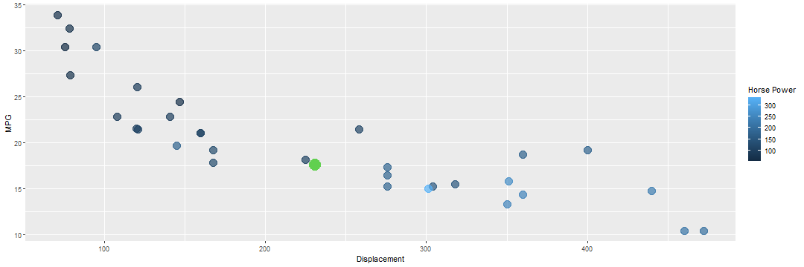

myAppPresentation
========================================================
author: created by myk137
date: 
autosize: true
transition: rotate

Data
========================================================


myApp uses 'mtcars' dataset. Random forest method is used to model outcome MPG against two predictors Displacement and Horse Power.


```r
mtcar <- mtcars[,c(1,3,4)]; 
head(mtcar,5)
```

```
                   mpg disp  hp
Mazda RX4         21.0  160 110
Mazda RX4 Wag     21.0  160 110
Datsun 710        22.8  108  93
Hornet 4 Drive    21.4  258 110
Hornet Sportabout 18.7  360 175
```

Modelling by Random Forest Method
========================================================


```r
model <- randomForest(mpg ~ disp + hp, data=mtcar); 
model
```

```

Call:
 randomForest(formula = mpg ~ disp + hp, data = mtcar) 
               Type of random forest: regression
                     Number of trees: 500
No. of variables tried at each split: 1

          Mean of squared residuals: 5.806874
                    % Var explained: 83.5
```

Prediction of Miles/gallon
========================================================

Prediction function is used to predict 'MPG' when user inputs 'displacement' and 'horse power' as represented by 'disp' and 'hp' respectively.   


```r
dispInput <- round(mean(mtcars$disp))
hpInput <- round(mean(mtcars$hp))
modelpred <- predict(model, newdata = data.frame(disp = dispInput, hp = hpInput))
modelpred
```

```
       1 
17.56901 
```

Plot of 'mtcars' dataset
========================================================


```r
ggplot(mtcar, aes(y=mpg, x=disp, color=hp)) + geom_point(size=5, alpha=0.7) + labs(x="Displacement", y="MPG") + labs(colour="Horse Power") + geom_point(x=dispInput, y=modelpred, color=hpInput, size=7)
```


